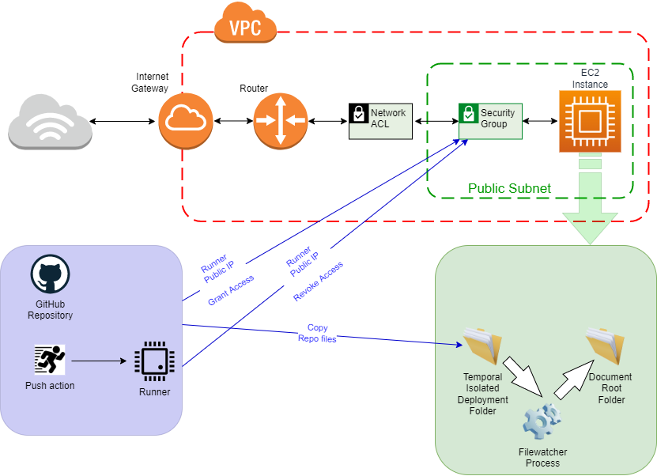

# putfiles2ec2
Publish files to EC2 instance

[](https://github.com/antoniohernan/putfiles2ec2/actions/workflows/sast.yml) [](https://github.com/antoniohernan/putfiles2ec2/actions/workflows/deployec2.yml)

Action to deploy code/files on an EC2 instance.
The action opens the SFTP connection to the public IP address of the runner running in the security group of the EC2 instance.

Deposits the files in the configured path and closes the security group again, whether the data transfer exists or not.

## Diagram



## Prerequisites

- EC2 instance with elastic IP assigned or other mechanism that allows us to identify it by name
- Security Group
- AWS credentials to modify the security group

The policy for IAM credentials can be, for example, as follows:
```
{
    "Version": "2012-10-17",
    "Statement": [
        {
            "Sid": "VisualEditor0",
            "Effect": "Allow",
            "Action": [
                "ec2:RevokeSecurityGroupIngress",
                "ec2:AuthorizeSecurityGroupIngress",
                "ec2:CreateTags"
            ],
            "Resource": "arn:aws:ec2:*:<your_account_id>:security-group/sg-<your_security_group>"
        }
    ]
}
```

## Variables & Secrets

- AWS_KEY: EC2 instance key pair to be used for SFTP connection

- AWS_ACCESS_KEY_ID: IAM credentials for modification of EC2 instance security rules

- AWS_SECRET_ACCESS_KEY: IAM credentials for modification of EC2 instance security rules

- AWS_REGION: Region where we have our EC2 deployed

- AWS_SGWEB: Security group in which our EC2 instance is located

- AWS_VMPORT: Port we want to enable

- AWS_VMKEYFILE: File (with full path) of ssh key on the action runner machine

- AWS_VMUSERNAME: EC2 user

- AWS_VMFQDN: EC2 FQDN or elasticIP

- AWS_DESTINATION: EC2 destination path

- TRASH: Dummy variable

## Steps

The steps performed by this action are:

1. Configures on the runner machine an AWS client with the credentials that allows you to modify the security group.

2. Obtains the public IP address of the runner machine

3. Enables the connection between the runner machine and the EC2 instance for the port we will use for the `scp`.

4. Prepares the runner machine to make the connection to the EC2 instance (ssh key)

5. Checkout the repository

6. Copies the files from the runner machine to the EC2 instance

7. Revokes the access of the runner machine to the EC2 instance, whatever the status of all the previous steps.

## EC2 Instance file watcher

In order to copy the files deployed by the script in the AWS_DESTINATION secret, you can use your own adaptation of this script  `deployfiles_monitor.sh`:

```
#!/usr/bin/env bash

user=www-data
group=www-data
origin=/Deployments
target=/var/www/<virtualhost_documentroot>/

# Check if another instance of script is running
[[ $(lsof -t $0| wc -l) > 1 ]] && echo "At least one of $0 is running" && exit

while true
do
	#Inotify Trigger
	inotifywait -r --exclude "(swp|swx)"  -e close_write -t 300 ${origin}
	cp -pr ${origin}/* ${target}
	chown -R ${user}:${group} ${target}
	sleep 30
done
```

The process execute de inode notifier and wait 300 seconds looking for file changes/new files.

You need to additionally configure the system crontab to restart the execution of the script every, for example, 10 minutes.

```
*/10 * * * * /root/Scripts/deployfiles_monitor.sh
```

This scripts has "Single run only" protection.

## Known errors and warnings

10/10/22 ```Node.js 12 actions are deprecated.```
There is an open issue, waiting for resolution and new version, with V.1.7 the warning is still present.

https://github.com/aws-actions/configure-aws-credentials/pull/413


## License
The code is under **Creative Commons Attribution-ShareAlike 4.0 International Public License**, view the license at: https://github.com/antoniohernan/putfiles2ec2/blob/main/LICENSE.txt


